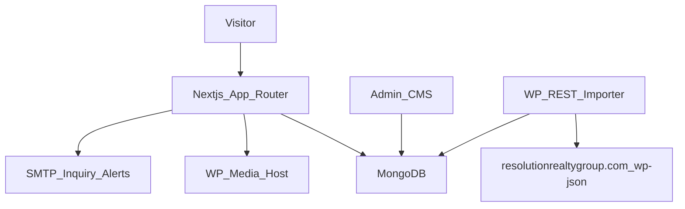

# Resolution Realty Group — Next.js rebuild (copy this into a new Cursor project)

## What this project is

Create a **new** Next.js app that visually and structurally clones [https://resolutionrealtygroup.com/](https://resolutionrealtygroup.com/) the same way Dream Home Collections cloned its WordPress site.

**Do not copy the Dream Home Collections luxury navy/gold look.** Copy RRG’s live Elementor UI (coral + near-black, Inter/Poppins, top bar, dropdowns, listing cards, guarantee pages). Reuse DHC’s **backend patterns** (Mongo models, admin CMS, inquiry API, slug resolver, WP image linking), not its marketing chrome.

WordPress stays live. **Do not download the media library.** Point every image at `https://resolutionrealtygroup.com/wp-content/uploads/...`.

Reference live site constantly while building. Open desktop and mobile viewports and match spacing, type scale, hover states, and breakpoints.

---

## Tech stack (same as Dream Home Collections)

- Next.js 15 App Router + Turbopack
- React 19 + TypeScript
- Tailwind CSS v4 (`@import "tailwindcss"`)
- MongoDB + Mongoose (content + inquiries)
- Admin CMS at `/admin` (JWT cookie + bcryptjs + jose)
- Cloudflare R2 only for **new** admin uploads (legacy images stay on WP)
- Nodemailer for inquiry alerts
- Vercel (`vercel.json` framework `nextjs`)
- `next/font/google`: **Inter** (headings, 700) + **Poppins** (body/UI, 400–500)

**Skip DHC-only public features that RRG does not have:** neighborhoods hub, Texas service-area map, member login/register/favorites, `/our-blogs` slug (RRG uses `/blogs/`).

---

## Design tokens (match the live site)

Put these in `src/app/globals.css`:

- Navy / near-black: `#25212F`
- Coral CTA: `#EB6650` (hover `#C14632`)
- Gold accent: `#E3B96A`
- Cream background: `#F9F7F3`
- Body gray: `#8B8B8B`
- White / light gray: `#FFFFFF` / `#F5F5F5`

Shared classes: `.container-shell` (wide Elementor-like max width ~1200–1280px), `.btn-coral` (uppercase coral pills used for **BOOK A CALL NOW!** / **GET MY CASH OFFER NOW!**), `.section-title`, `.field-input`.

Logo URL (link, do not download unless needed as favicon fallback):

`https://resolutionrealtygroup.com/wp-content/uploads/2025/06/logo-rv-03.png`

Allow `resolutionrealtygroup.com` and `www.resolutionrealtygroup.com` in `next.config.ts` `images.remotePatterns`. Set `trailingSlash: true` so permalinks match WordPress (`/about/`, `/6808-pentridge-drive/`).

---

## Site constants (`src/lib/site.ts`)

- Name: Resolution Realty Group
- Email: concierge@resolutionrealtygroup.com
- Phone: (469) 837-8891 (`tel:+14698378891`)
- Office: 508 North 2nd Street, Honey Grove, TX 75446
- Agent: David Josh, MBA — brokered by Central Metro Realty
- Socials: YouTube `@ResolutionRealtyGroup`, Instagram `@daviator21`, Facebook `davidcjosh`, LinkedIn company page
- Tagline: **90 Days to Sold Guaranteed or David Will Buy It!**

---

## Information architecture

Header top bar: email + phone.

Primary nav (match live dropdowns):

- Free Home Valuation → `/free-home-valuation/`
- Listings dropdown:
  - `/6808-pentridge-drive/`
  - `/6809-pentridge-drive/`
  - `/2432-oconnor-ranch-dr-weatherford-tx-76087/`
  - `/1105-w-2nd-street-white-deer-tx-79097/`
- Our Guarantees dropdown:
  - `/sold-in-90-days-guarantee/`
  - `/sell-your-home-fast-with-our-solid-cash-offer-guarantee/`
  - `/no-lock-in-listing-guarantee/`
  - `/trade-up-and-buy-your-dream-home-in-texas/`
  - `/first-access-program/`
- Testimonials → `/#testimonials` (on-site carousel; live site currently opens Google Maps — recreate the homepage reviews on-site)
- Our Team → `/about/`
- Header CTA: **BOOK A CALL NOW!** → `#contact` / book-a-call form

Mobile: hamburger, stacked nav, full-width coral buttons, single-column cards. Recreate Elementor’s desktop-vs-mobile header split (compact logo + hamburger under ~1024px).

Footer: office / email / phone, guarantee links, blog, about, mission, privacy, terms, socials. Use **working** slugs (the live footer has a broken Trade-Up URL and a 403 MLS link). Omit `/mls-search/` (WordPress returns 403) and `/areas-we-serve/` (404) unless you add a simple “call us to search MLS” placeholder.

---

## Routes to build (preserve WP slugs)

**Core**

- `/` homepage (`home-v2` content)
- `/about/` (Our Team nav target)
- `/team/`
- `/our-mission/`
- `/contact/` → redirect to `/contact-us-texas-real-estate/`
- `/contact-us-texas-real-estate/`
- `/free-home-valuation/`
- `/blogs/` (`/blog/` redirects here)
- `/privacy-policy/`
- `/terms-and-conditions/` (`/terms/` redirects here)
- `/category/[slug]/` for city categories (Addison, Plano, Frisco, etc.)

**Guarantees / programs** (recreate even if copy overlaps — keep permalinks)

- `/sold-in-90-days-guarantee/`
- `/sell-your-home-fast-with-our-solid-cash-offer-guarantee/`
- `/no-lock-in-listing-guarantee/`
- `/our-cancel-anytime-listing-guarantee/`
- `/trade-up-and-buy-your-dream-home-in-texas/`
- `/buy-your-dream-home-in-texas/`
- `/first-access-program/`
- `/guaranteed-offer-program/`
- `/sell-your-home/`
- `/contact-us-texas-real-estate-2/` (alternate 90-days landing; can reuse homepage sections)

**Listings**

- `/6808-pentridge-drive/` — Plano, **$620,000**, 6 bed / 4 bath / 3,791 sqft
- `/6809-pentridge-drive/` — Plano, **$591,000**, 4–5 bed / 4 bath / ~3,085 sqft
- `/2432-oconnor-ranch-dr-weatherford-tx-76087/` — Weatherford, **$350,000**
- `/1105-w-2nd-street-white-deer-tx-79097/` — White Deer, **$120,000**
- `/oconnor-ranch/` companion page

**Catch-all** `src/app/(marketing)/[slug]/page.tsx` resolves listing → guarantee/page → post (same idea as DHC `content-resolver.ts`). Reserved slugs: `admin`, `api`, `blogs`, `blog`, `category`, `about`, `team`, `contact`, etc.

**Admin (not on the public WP site, but required like DHC)**

- `/admin/login`, `/admin/listings`, `/admin/posts`, `/admin/inquiries`, `/admin/settings`
- No public member portal

---

## Homepage sections (top → bottom — match live)

1. Utility bar (email, phone, social icons)
2. Logo + nav + BOOK A CALL NOW
3. Hero: “90 Days to Sold Guaranteed or David Will Buy It!” + supporting copy + **GET MY CASH OFFER NOW!** (→ cash-offer / contact form with `source=cash-offer`)
4. Three pillars: Expert Guidance / Seamless Process / Results
5. Featured listings carousel/grid (“Explore Our Featured Listings”). Homepage cards currently show **monthly-style** figures (`$4,815 | Month`) while detail pages show sale price — keep both via `priceLabel` on cards and `priceUsd` on detail.
6. About: “Building Dreams, One Home at a Time” + years counter + socials
7. Process 01–03: Local Expertise, Personalized Service, Proven Results
8. Cancel Anytime teaser + FAQ accordion
9. Recent blogs (3 cards) + View All → `/blogs/`
10. FAQ block
11. Testimonials carousel (Michelle R, James L, Tanya D, Lisa M, David P — copy from live homepage)
12. Contact: “Message Me Today – 90 Days to Sold…” + **native** inquiry form (not GoHighLevel iframe)
13. Footer

Do **not** embed LeadConnector/GHL booking, forms, or chat widgets.

---

## Native forms (replace GHL)

Same pattern as DHC `InquiryForm` → `POST /api/inquiries` → Mongo `Inquiry` + SMTP to `INQUIRY_NOTIFY_EMAILS`.

| Surface | `source` | Extra fields |
|---|---|---|
| Homepage / contact | `contact` | name, email, phone, message |
| Book a call CTA | `book-call` | name, email, phone, preferred time |
| Cash offer CTA | `cash-offer` | name, email, phone, property address, message |
| Free home valuation | `valuation` | name, email, phone, property address, city, notes |
| Listing detail | `listing` | plus listingSlug / listingTitle |

Style forms to look like the live GHL cards (light panel, coral submit, rounded inputs) so the layout still matches.

---

## Images

- All WP media: keep absolute URLs on `https://resolutionrealtygroup.com/wp-content/...`
- Use a `RemoteImage` component (`` with fallback), same as DHC
- `next.config.ts` remotePatterns for that host
- `WP_MEDIA_ORIGIN = "https://resolutionrealtygroup.com"` (no wpdns rewrite needed while WP stays on this domain)
- Extract listing/hero/background URLs from the live pages while building; do not hotlink unrelated third-party images

---

## Content strategy

**Marketing pages:** hand-build React sections that match the live layout. Do not dump Elementor HTML into the app (it will not be responsive or maintainable).

**Listings:** seed `src/data/listings.ts` with structured fields (slug, address, sale price, beds/baths/sqft, features, description, WP image URLs, `featuredOnHome`, `priceLabel` for homepage monthly display). Scrape copy from each live listing page.

**Blog (~1,180 posts):** do **not** hand-write TypeScript seed arrays. Add `scripts/import-wp-posts.mjs` that:

1. Paginates `https://resolutionrealtygroup.com/wp-json/wp/v2/posts?per_page=100&_embed=1`
2. Also imports `https://resolutionrealtygroup.com/wp-json/wp/v2/categories?per_page=100`
3. Maps `slug`, `title.rendered`, `excerpt.rendered`, `content.rendered`, featured image from `_embedded['wp:featuredmedia']`, category name/slug, `date`, Rank Math-ish SEO from `yoast_head_json` or `rank_math` if present, else title/excerpt
4. Upserts into Mongo `Post` by slug
5. **Skips** spam slug `kms-activator-download`
6. Leaves all `` in post HTML pointing at the WP host
7. If `content.rendered` is empty for a post, fetch the public post URL and extract the article body as a fallback

Blog index `/blogs/` should paginate (the live site is a long grid). Category pages at `/category/[slug]/`. Post permalinks stay flat: `/{post-slug}/` via the catch-all route.

---

## Suggested folder layout

```
src/app/(marketing)/page.tsx          # homepage
src/app/(marketing)/blogs/page.tsx
src/app/(marketing)/free-home-valuation/page.tsx
src/app/(marketing)/[slug]/page.tsx   # listings, guarantees, posts
src/app/admin/...                     # CMS
src/app/api/inquiries/route.ts
src/components/header.tsx
src/components/footer.tsx
src/components/inquiry-form.tsx
src/components/listing-card.tsx
src/components/testimonial-carousel.tsx
src/components/faq-accordion.tsx
src/data/listings.ts
src/data/pages.ts                     # guarantee/about/mission copy
src/lib/site.ts
src/lib/wp-media.ts
src/lib/content-resolver.ts
scripts/import-wp-posts.mjs
scripts/seed.mjs                      # listings + static pages only
```

---

## Architecture



Public pages: Mongo if `MONGODB_URI` is set and collections have docs; otherwise fall back to `src/data/*` for listings/static pages. Blog archive requires Mongo after import (too large for a TS fallback).

---

## Implementation order (for the new-project agent)

1. Scaffold Next.js 15 + Tailwind v4 + env template (Mongo, AUTH_SECRET, ADMIN_*, SMTP, SITE_URL, R2 optional).
2. Global design tokens, fonts, Header, Footer, mobile nav — match live site first.
3. Homepage sections 1–13 with placeholder listing/blog data.
4. Listing seed + listing detail UI (gallery, specs, inquiry form).
5. Guarantee / about / team / mission / contact / valuation / legal pages.
6. Native inquiry API + admin inquiries.
7. Admin posts/listings CRUD.
8. WP REST importer + `/blogs/` pagination + `/category/[slug]/` + catch-all post pages.
9. SEO: `generateMetadata`, sitemap (static routes + listing slugs + paginated post slugs), robots, JSON-LD for listings (`RealEstateListing`) and articles.
10. Redirects: `/blog` → `/blogs/`, `/contact` → `/contact-us-texas-real-estate/`, `/terms` → `/terms-and-conditions/`.
11. Visual QA: walk every route on desktop and mobile against the live WordPress site; fix spacing, type, and breakpoints until they match.

---

## Explicit non-goals

- Do not rebuild Realtyna MLS search (`/mls-search/` is 403).
- Do not embed GoHighLevel / LeadConnector.
- Do not import the spam “kms activator” post.
- Do not restyle this as Dream Home Collections (no Cormorant/Outfit luxury theme).
- Do not download the full WP uploads folder.
- Do not add a public member portal unless asked later.

---

## Brand / contact facts to hardcode

- Promise: 90 Days to Sold, or David will buy it
- Cancel anytime / no lock-in listing (no fees)
- Solid cash offer / as-is / close ~7 days
- Trade-Up: buy their listing, they help buy your current home
- First Access: off-market / coming-soon buyer list
- Testimonials: keep the live homepage quotes and names

Live WP APIs for the importer:

- Pages: `https://resolutionrealtygroup.com/wp-json/wp/v2/pages?per_page=100`
- Posts: `https://resolutionrealtygroup.com/wp-json/wp/v2/posts?per_page=100`
- Categories: `https://resolutionrealtygroup.com/wp-json/wp/v2/categories?per_page=100`
- Media: `https://resolutionrealtygroup.com/wp-json/wp/v2/media`

Sitemap endpoints currently 500; do not rely on them.
